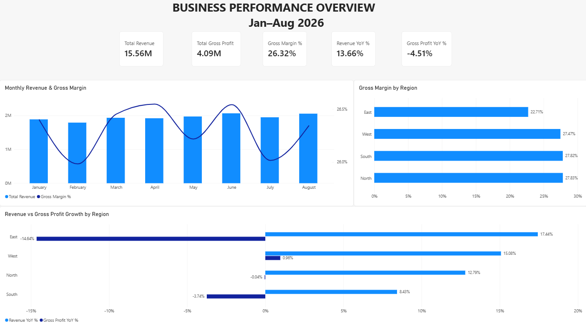
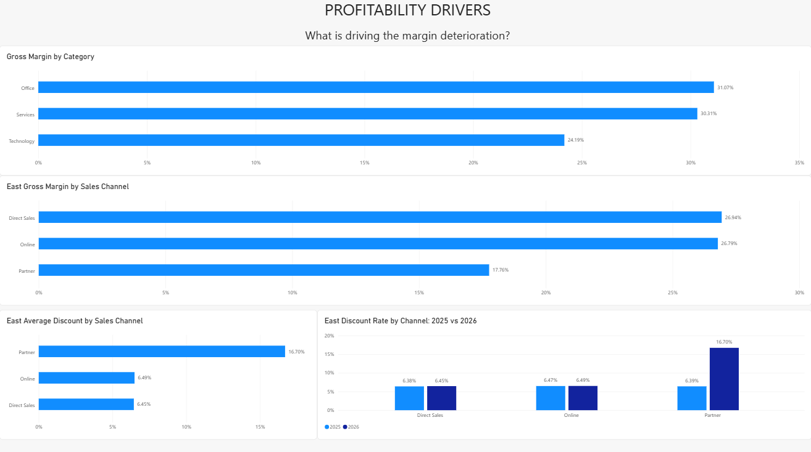
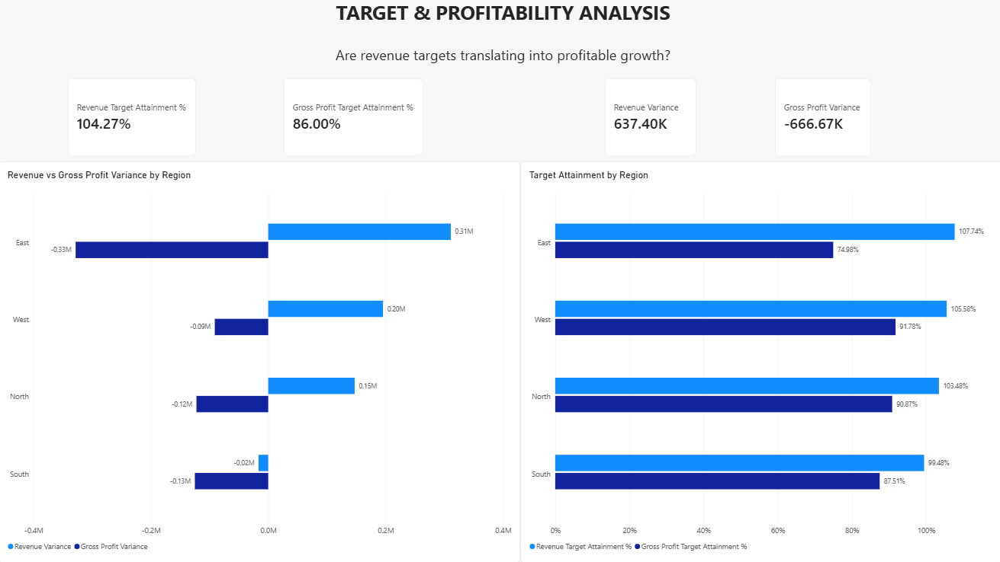

# Business Performance & Profitability Analysis

## Executive Summary

Revenue growth is not translating into profitable growth.

From **Jan–Aug 2026**, revenue increased **13.66% YoY**, while gross profit declined **4.51%**, reducing gross margin from **31.32% to 26.32%**.

The analysis identified two main profitability pressures:

- **Technology** shows broader cost and margin pressure across the business.
- **East** experienced the sharpest deterioration, strongly associated with rapid expansion of the **Partner** channel. Partner discounts increased from approximately **6.4% to 16.7%**, while gross margin fell to **17.8%**.

This disconnect is also visible against management targets. The business achieved **104.27% of its revenue target**, but only **86.00% of its gross profit target**.

The results suggest that revenue growth alone is masking weakening business economics.

---

## Business Problem

Management is seeing continued revenue growth but is concerned that profitability is not improving at the same pace.

Some regions and product categories are missing profitability expectations, creating the need to understand whether growth is actually generating business value.

The analysis focuses on the following question:

> **Is the business growing profitably, and which products, customers, and regions are driving or weakening performance against targets?**

**Analysis period:** January 2024 – August 2026

For YoY comparisons involving 2026, **Jan–Aug periods are compared consistently** to avoid comparing a partial year with a full year.

---

## Dataset

The analysis uses a simulated business dataset containing:

- **Customers** — customer, segment and region information
- **Products** — product, category and subcategory information
- **Orders** — transaction dates, customers, regions and sales channels
- **Order Items** — quantity, price, discount and unit cost
- **Targets** — monthly revenue and gross profit targets by region

Before analysis, data quality checks identified:

- **12 missing customer segments**
- **50 duplicated order-item records**
- No missing customer regions
- No duplicated month-region target combinations

Missing customer segments were classified as `Unknown`, and duplicate order items were removed before calculating business metrics.

---

## Methodology

### 1. Data Quality & Preparation

PostgreSQL was used to validate row counts, missing values, duplicate records, date coverage and target uniqueness.

A reusable analytics layer was then created to combine transactional and dimensional data and calculate:

- Revenue
- COGS
- Gross Profit
- Gross Margin

### 2. Business Performance Analysis

Revenue, gross profit and gross margin were analyzed over time to determine whether business growth was translating into stronger profitability.

Comparable Jan–Aug periods were used for YoY analysis.

### 3. Profitability Driver Analysis

Performance was segmented by:

- Region
- Product category
- Sales channel
- Discount level
- Product cost

This allowed the analysis to move from the company-level profitability decline toward the areas contributing most strongly to the deterioration.

### 4. Target Variance Analysis

Actual revenue and gross profit were compared with monthly regional targets.

Both **absolute variance** and **target attainment %** were evaluated to distinguish revenue growth from profitable growth.

### 5. Customer Concentration Validation

The East Partner channel was analyzed at customer level to determine whether its rapid growth was caused by a small number of large customers or represented broader channel expansion.

---

## Key Findings

### 1. Revenue is growing, but profitability is deteriorating

Jan–Aug 2025 vs Jan–Aug 2026:

- **Revenue:** +13.66%
- **Gross Profit:** -4.51%
- **Gross Margin:** 31.32% → 26.32%

The company is generating more sales without generating proportionally more gross profit.

---

### 2. Technology shows the strongest category-level margin pressure

Technology recorded a **24.19% gross margin** in Jan–Aug 2026, below the other major categories.

The analysis also identified increasing product costs, indicating that profitability pressure is not isolated to a single region.

---

### 3. East is the clearest regional profitability outlier

In Jan–Aug 2026, East revenue increased approximately **17.4% YoY**, while gross profit declined approximately **14.6%**.

Gross margin fell from:

**31.25% → 22.71%**

This was the largest regional deterioration observed.

---

### 4. Partner expansion is strongly associated with East's margin decline

Within East, the Partner channel expanded rapidly.

Average Partner discount increased from approximately:

**6.4% → 16.7%**

At the same time, Partner gross margin fell to approximately:

**17.8%**

Partner order volume also more than doubled.

This indicates that a substantial part of East's revenue growth is being generated under significantly weaker unit economics.

---

### 5. Partner growth is not concentrated in a few customers

East Partner active customers increased from:

**316 → 427**

Meanwhile, the Top 10 customers' share of Partner revenue declined from:

**11.59% → 7.61%**

The deterioration therefore does not appear to be explained by a few unusually large accounts. The pattern is consistent with broader channel expansion.

---

### 6. Revenue targets are being achieved while profit targets are being missed

Jan–Aug 2026:

- **Revenue Target Attainment:** 104.27%
- **Gross Profit Target Attainment:** 86.00%
- **Revenue Variance:** +637.40K
- **Gross Profit Variance:** -666.67K

Three of four regions exceeded their revenue targets, while **all four regions missed gross profit targets**.

East showed the largest mismatch:

- **Revenue Target Attainment:** 107.74%
- **Gross Profit Target Attainment:** 74.98%

Revenue performance alone therefore gives an incomplete picture of business health.

---

## Business Recommendations

### Review East Partner discount governance

Investigate Partner commercial terms, discount approval thresholds and deal structures in East.

The objective should not necessarily be to reduce Partner activity, but to determine whether current discount levels are economically justified.

### Introduce profitability guardrails alongside revenue targets

Regional and channel performance should be evaluated using both revenue and gross profit metrics.

Revenue growth that materially reduces margin should not automatically be considered successful performance.

### Investigate Technology cost pressure

Review supplier costs, product pricing and category-level cost changes to determine why Technology margins are deteriorating across multiple regions.

### Monitor channel economics

Track revenue, gross profit, gross margin and discount levels by channel over time.

This would allow management to identify situations where commercial growth begins to weaken profitability.

---

## Limitations

This analysis identifies relationships in the available data but does not establish causality.

Additional information would be required to fully explain the profitability deterioration, including:

- Operating expenses
- Marketing and acquisition costs
- Freight and logistics costs
- Customer contract terms
- Competitive pricing
- Price elasticity
- Customer lifetime value

The project therefore evaluates **gross profitability**, not net profitability.

The dataset is simulated for portfolio purposes.

---

## Next Steps

Further analysis could include:

- Customer-level profitability
- Product-level cost variance
- Discount elasticity analysis
- Contribution margin analysis
- Year-end target forecasting
- Profitability scenarios under different discount and cost assumptions

---

## Excel Validation

Excel and Power Query were used to independently prepare and validate the analytical dataset.

SQL results were cross-checked using PivotTables and comparable Jan–Aug periods before the reporting layer was built in Power BI.

---

# Power BI Dashboard

## Executive Performance

Provides an executive view of revenue, gross profit, margin and YoY performance, including regional profitability trends.

---

## Profitability Drivers

Investigates the drivers behind margin deterioration, including category performance, East channel profitability and the sharp increase in Partner discounts.

---

## Target & Profitability Analysis

Compares actual business performance against revenue and gross profit targets and highlights the gap between commercial growth and profitability.

---

## Tools & Skills

**PostgreSQL**
- Data quality validation
- Joins and CTEs
- Window functions
- Analytical views
- Aggregation and segmentation
- Variance analysis

**Excel / Power Query**
- Data preparation
- Table relationships
- Calculated business metrics
- PivotTable validation
- Cross-tool result validation

**Power BI / DAX**
- Data modeling
- Calendar and region dimensions
- DAX measures
- YoY analysis
- Target attainment
- Variance analysis
- KPI reporting
- Business-focused dashboard design

---

## Repository Files

| File | Description |
|---|---|
| `01_data_quality.sql` | Data quality and integrity checks |
| `02_analytics_layer.sql` | Clean analytical views and business metrics |
| `03_business_performance_analysis.sql` | Business performance, profitability and target analysis |
| `Business_Performance_Profitability_Analysis.xlsx` | Excel / Power Query validation |
| `Business_Performance_Profitability_Analysis.pbix` | Power BI analytical report |
| `executive_performance.png` | Executive dashboard |
| `profitability_drivers.png` | Profitability driver analysis |
| `target_profitability.png` | Target and profitability analysis |

---

## Project Objective

This project demonstrates an end-to-end analytical workflow:

**Business Problem → Data Quality → SQL Analysis → Excel Validation → Power BI Modeling → Business Findings → Recommendations**

The focus is not only on reporting what happened, but on investigating **whether business growth is actually creating value and where management should investigate further**.
